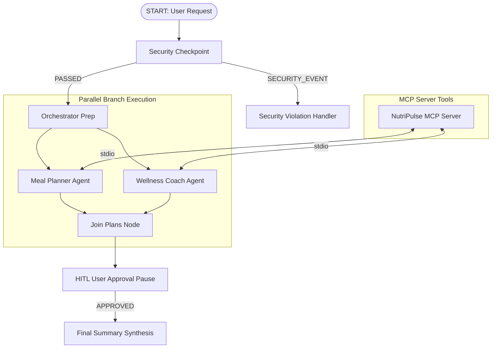

# NutriPulse Coach — Submission Write-Up

## Problem Statement
Maintaining a healthy lifestyle requires synthesizing complex nutritional science, biometric targets, daily dietary restrictions, and workout planning. Most individuals struggle with generic diet plans that fail to adapt dynamically or protect sensitive personal health data. NutriPulse Coach addresses this by delivering automated, secure, and personalized nutrition guidance through an intelligent multi-agent AI framework.

## Solution Architecture
NutriPulse Coach is engineered using the Google Agent Development Kit (ADK 2.0) Workflow graph API. The system coordinates dual specialized agents running in parallel, governed by an entry security checkpoint and a human-in-the-loop (HITL) confirmation node.

## Concepts Used

1. **ADK Workflow Graph API** (`app/agent.py`): Defined using `Workflow` with function nodes, parallel branch fan-out/fan-in via `JoinNode`, and explicit conditional route mappings.
2. **Specialized LlmAgents** (`app/agent.py`): `meal_planner` and `wellness_coach` configured with strict Pydantic `output_schema` models for structured data emission.
3. **MCP Server Integration** (`app/mcp_server.py`): Built with FastMCP over stdio transport and wired into LLM agents using `McpToolset`.
4. **Security Checkpoint** (`app/agent.py`): Mandatory pre-processing node handling regex PII scrubbing, prompt injection defense, and structured JSON audit logging.
5. **Human-in-the-Loop (HITL)** (`app/agent.py`): Implemented via `RequestInput` to pause workflow execution for user review before generating final summaries.
6. **Agents CLI & Toolchain**: Scaffolded and orchestrated using `agents-cli` and managed with reproducible `uv` environment isolation.

## Security Design

- **PII Scrubbing**: Automatically detects and replaces sensitive personal identifiable information (emails, phone numbers, SSNs, credit card numbers) with `[REDACTED_*]` tokens before prompt evaluation.
- **Prompt Injection Defense**: Scans incoming text against known attack patterns (`ignore previous instructions`, `jailbreak`, `override security`). Violations route to a dedicated `SECURITY_EVENT` terminal node.
- **Audit Logging**: Emits structured JSON events with severity levels (`INFO`, `WARNING`, `CRITICAL`) for security monitoring and compliance.
- **Domain Guardrails**: Enforces health guardrails by flagging extreme calorie deficit targets (<1000 kcal/day) with medical review disclaimers.

## MCP Server Design

The Model Context Protocol (MCP) server (`app/mcp_server.py`) exposes four domain-specific tools:
- `calculate_bmi`: Evaluates height/weight metrics and categorizes health ranges.
- `get_macronutrient_targets`: Dynamically calculates daily protein, carb, and fat gram targets based on overall calorie goals and fitness objectives (bulking, cutting, maintenance).
- `search_recipes`: Queries filtered recipe database matching dietary preferences and calorie ceilings.
- `log_daily_water_intake`: Tracks daily hydration against standard 2.5L targets.

## HITL Flow

To prevent automated generation of unverified wellness plans, the workflow features a human-in-the-loop checkpoint (`hitl_approval`). After specialized agents complete their parallel calculations, execution yields a `RequestInput` event. The user reviews the proposed breakdown and confirms (`proceed`) before the system synthesizes the final comprehensive report.

## Demo Walkthrough

The demo walk-through demonstrates three core scenarios:
1. **Standard Workflow**: Handling user requests, redacting PII, executing parallel sub-agents, querying MCP tools, and obtaining HITL approval.
2. **Health Warning Handling**: Injecting caution advisories when unsafe dietary parameters are requested.
3. **Security Interception**: Blocking prompt injection attacks proactively at the entry node.

## Impact / Value Statement

NutriPulse Coach demonstrates how modern AI agents can transform personal wellness management. By combining strict security controls with modular multi-agent collaboration and standardized MCP tooling, NutriPulse provides users with safe, deterministic, and highly personalized health guidance while ensuring user privacy and safety at every step.
